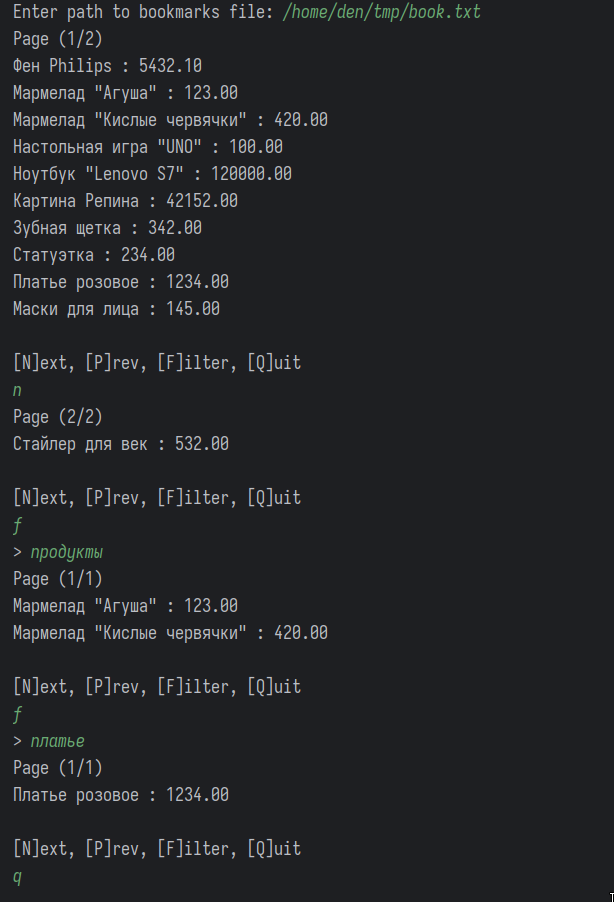

# Каталог товаров

## Постановка задачи

Вы разрабатываете каталог для маркетплейса, который продаёт товары разных категорий. Программа должна уметь загружать товары из файла в список и выводить их постранично, чтобы не выкидывать на пользователя сразу все позиции. Также пользователь должен иметь возможность искать товары.  

## Требования к реализации

Проект должен включать:

- набор классов, которые реализуют требуемую логику;
- обработку взаимодействия с пользователем через консольный ввод/вывод;
- обработку ошибок (неверный ввод пользователя): должно быть реализовано через бросание и поимку exception;
- покрытие тестами логики программы через Junit;
- документацию: README с описанием проекта, инструкциями по запуску.

Используйте Git для совместной работы. Не забудьте проверить работоспособность кода и предусмотреть различные сценарии поведения программы!

## Требования к структуре проекта

Ваша задача — это маленький кусок кода в будущем огромном проекте маркетплейса. Нужно хорошо продумать реализацию каталога, предусмотреть удобный API, который будет инкапсулировать логику пагинации, поиска, описания позиций каталога внутри классов. Кроме того, необходимо заложиться на будущие доработки, которые будут включать в себя операции по созданию, изменению и удалению элементов каталога.

Архитектор проекта утвердил следующую структуру:

```
.
├── CatalogApplication.java 
├── collection
│   └── ItemList.java
├── io
│   └── CatalogLoader.java
├── model
│   ├── Item.java
│   └── storage
│       ├── Catalog.java
│       └── CatalogPage.java
└── Session.java
```

  

Также описаны требования к каждому классу:

- `CatalogApplication` — класс с main-методом, отвечает за обработку пользовательского ввода/вывода.
- `collection/ItemList` — класс, который отвечает за хранение элементов каталога. Позволяет динамически добавлять в него элементы, в отличие от простого массива.
- `io/CatalogLoader` — отвечает за загрузку каталога из `csv`-файла.
- `model/Item` — хранит поля, которые описывают товар.
- `model/storage/Catalog` — предоставляет API по поиску информации внутри каталога.
- `model/storage/CatalogPage` — предоставляет API по постраничной навигации внутри каталога.
- `Session` — содержит информацию о текущем состоянии программы: загруженный каталог, активная страница каталога, отфильтрованный каталог, если выполнялся поиск.


### Взаимодействие с пользователем

При старте программы у пользователя спрашивают путь к файлу с каталогом, после чего вычитывается и показывается первая страница (на одной странице — 10 элементов). Отображаются элементы на странице, информация о номере текущей страницы и количестве страниц во всём каталоге.

Далее пользователь может давать команды:

- Перейти на следующую страницу:
  - Если текущая страница последняя, то выводится предупреждение о том, что страниц больше нет.
- Перейти на предыдущую страницу:
  - Если текущая страница первая, то выводится предупреждение о том, что страниц больше нет.
- Выполнить поиск в каталоге:
  - При выполнении поиска его содержимое фильтруется согласно запросу, отображается первая страница найденных результатов. При вводе пустой строки поиска все элементы из каталога должны снова отобразиться постранично.
  - Для поиска необходимо искать вхождение поисковой строки внутри имени товара и его категории (без учёта регистра).

### Формат файла с товарами

Указываются последовательно имя, цена и категория товара, разделённые символами `##`.

Пример:

```
Фен Philips ## 1234.24 ## Бытовая техника
Мармелад "Кислые червячки" ## 243.2 ## Продукты
```

### Пример работающей программы


 

## Декомпозиция задач

### Распределение задач в команде

**Участник 1**

- Класс `CatalogApplication` с main-методом.
- Класс `CatalogLoader` и тесты для него.
- Класс `Session`.

  **Участник 2**


- Класс `Item`.
- Класс `ItemList` и тесты для него. 

  **Участник 3**


- Класс `Catalog` и тесты для него.
- Класс `CatalogPage` и тесты для него.

  **Общие задачи**
- Проектирование взаимодействия классов.
- Написание документации к функциям в классе.

### Советы по работе в команде

Не стоит сразу же реализовывать конкретные методы. Сначала определите зону ответственности каждого класса. Создайте классы и объявите методы, но не реализуйте их (чтобы компилятор не ругался, можно сразу бросать в теле метода эксепшн). Слейте всё это в единую кодовую базу.

После этого вам станет легче разрабатывать программу: у вас уже будет архитектурный скелет. Вы сможете писать код, который будет взаимодействовать с разными классами, даже если бизнес-логика в них ещё не реализована.

### Технические детали

#### Item

Класс должен описывать следующие поля товара:

- название,
- цена,
- категория.

Предусмотрите инкапсуляцию, значения должны быть доступны через геттеры, экземпляр должен создаваться через конструктор.

Предусмотрите метод, который преобразует объект в строку для его дальнейшего вывода на экран.

#### ItemList

Класс должен предоставлять следующие методы:

- добавление элемента в конец списка;
- получение элемента по индексу;
- получение размера списка.

> Вы используете отдельный класс вместо простого массива — для создания массива нужно заранее знать количество элементов, а вы при чтении файла его знать не будете.

> Подсказка по реализации: внутри этого класса изначально может быть массив, например, на 10 элементов. Если добавляется 11-й элемент, то вы создаёте массив в 2 раза больше (на 20 элементов), копируете туда 10 элементов со старого и добавляете 11-й элемент. Подумайте о том, чтобы этот внутренний массив остался частью реализации класса и не был доступен извне. Так вы реализуете принцип инкапсуляции. 

> Для любознательных: в стандартной библиотеке Java уже есть класс, который реализует такое поведение, — ArrayList, и он работает как контейнер для всех видов классов. Но для его вдумчивого использования необходимо знать как минимум о том, что такое дженерики — до этой темы мы дойдём в следующих лекциях. А пока вы реализуете его сами для класса Item. Это даст представление о его внутреннем устройстве, что часто спрашивают во время собеседования на джуна.

#### Catalog

Класс должен предоставлять следующие методы:

- получение страницы каталога `CatalogPage` по номеру и размеру страницы;
- добавление элементов в каталог (сами элементы каталог хранит в классе `ItemList`, который реализует второй участник);
- получение размера каталога (просто спросить у `ItemList`);
- фильтрация каталога: исходя из переданного значения поиска необходимо вернуть новый объект класса `Catalog`, который будет содержать только подходящие по поиску данные — `public Catalog filter(String search)`.

> Не модифицируйте существующий Catalog — создайте новый и верните его через метод. Это облегчит использование фильтрации внешним кодом.


#### CatalogPage

Должен предоставлять следующие методы:

- получение номера страницы (`pageNumber`);
- сколько всего страниц (`pageSize`);
- какой индекс в каталоге у первого элемента страницы (`offset`);
- метод `Item[] getItems()`, чтобы получить элементы на странице;
- метод `boolean hasNext()`, чтобы проверить, есть ли следующая страница;
- метод `CatalogPage next()`, чтобы получить следующую страницу;
- метод `boolean hasPrev()`, чтобы проверить, есть ли предыдущая страница;
- метод `CatalogPage getPrev()`, чтобы получить предыдущую страницу.

Также предоставьте метод, который возвращает строковое представление страницы для его последующего вывода на экран.

#### CatalogLoader

Должен предоставлять статический метод, который загружает информацию из файла и формирует объект `Catalog`.

> Используйте Scanner и методы класса String для корректного парсинга.

#### Session

В этом классе нужно хранить:

- `Catalog` со всеми позициями;
- отфильтрованный `Catalog`;
- `CatalogPage`, которая сейчас выбрана пользователем.

Продумайте, какие данные будут нужны классу `CatalogApplication` для отображения пользователю, и сделайте публичные методы доступа к ним. Подумайте, как пользователь будет сообщать об изменении страницы и фильтрации в класс `Session` — необходимо предоставить публичные методы.

#### CatalogApplication

Загрузите `Catalog` из файла, создайте экземпляр класса `Session`, который будет хранить все переменные состояния вашей программы.

Организуйте цикл, который будет выводить выбранную пользователем страницу каталога, спрашивать его о командах и выполнять их. Выполнение команд и изменение состояния приложения делегируйте классу `Session`. Метод в `main` должен только обрабатывать ввод-вывод.

Такое разбиение позволяет отделить логику, связанную с вводом-выводом в консоль, от бизнес-логики. Это помогает улучшить тестируемость кода, а также в дальнейшем вам будет проще заменить консольный ввод-вывод на отправку сообщений по HTTP, к примеру.

# Система оценивания

## Критерии оценки

Оценивается декомпозиция программы, инкапсуляция внутреннего устройства классов, рабочий функционал и написанные тесты. Оценки по каждому критерию суммируются.

### Функционал программы: 0–3 баллов

- 3 — программа работает, все граничные случаи учтены
- 2 — основной функционал работает, есть неучтённые флоу, которые могут приводить к падениям программы
- 1 — программа не запускается, есть отдельно работающие классы
- 0 — функционал не реализован

### Декомпозиция: 0–2 балла

- 2 — программа разбита на классы и пакеты, каждый из которых отвечает за свою часть работы
- 1 — ответственность некоторых классов смешана
- 0 — структура классов отсетствует

### Инкапсуляция: 0–2 балла

- 2 — инкапсуляция на уровне всех классов реализована полностью
- 1 — инкапсуляция реализована частично
- 0 — классы имеют публичные поля, их логику легко “сломать” снаружи

### Тестирование: 0–3 балла

- 3 — выполнено тестирование всего функционала, кроме консольного ввода/вывода; есть тесты на чтение `Catalog` из файла
- 2 — отсутствуют некоторые тесты
- 1 — есть небольшое количество тестов
- 0 — код не покрыт тестами


